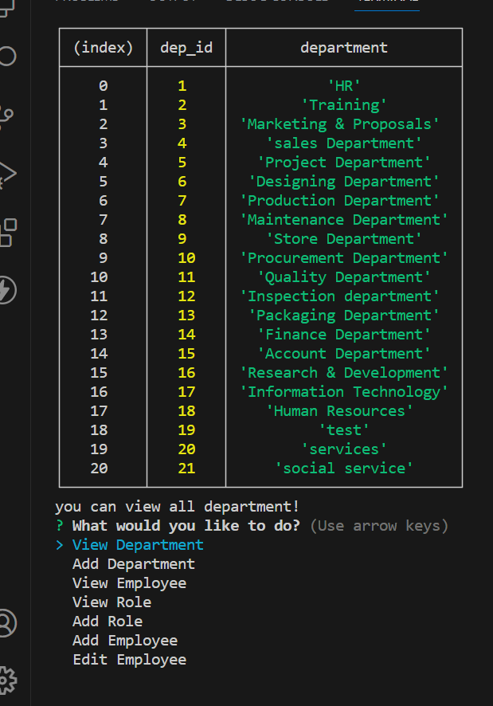
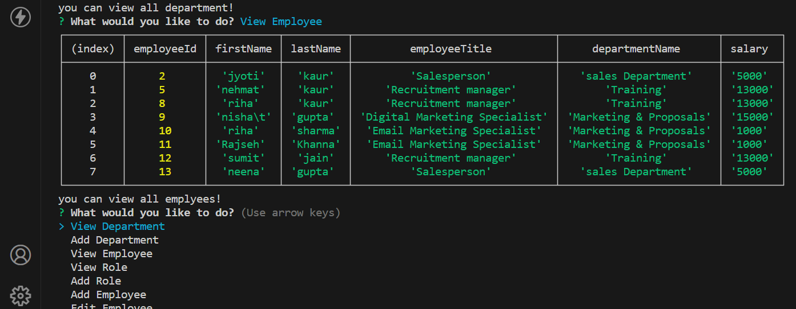
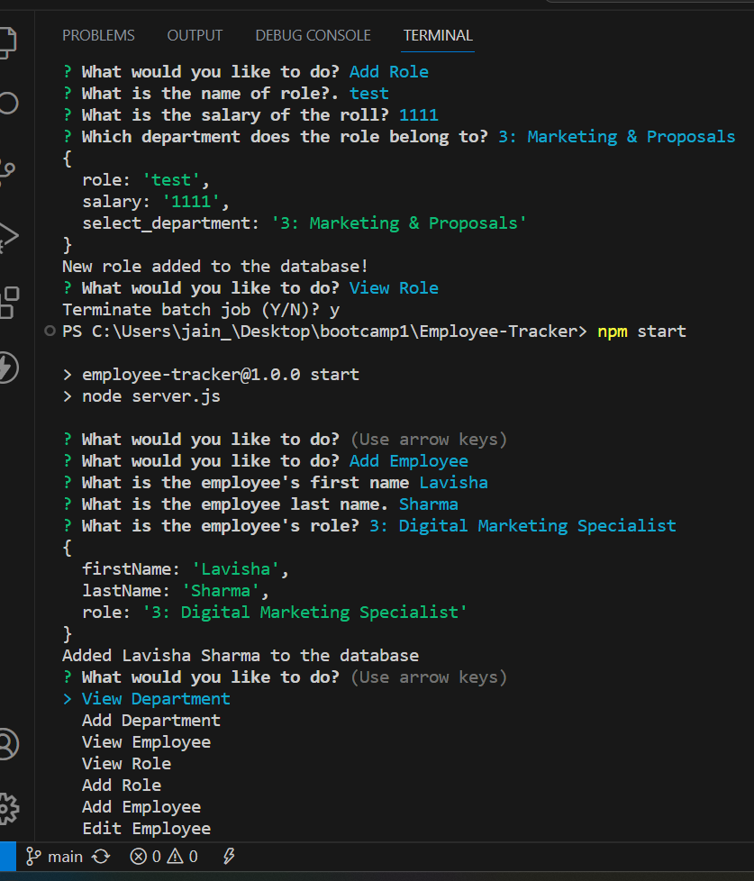
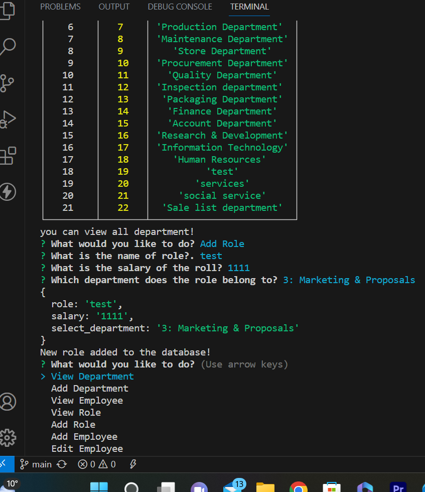
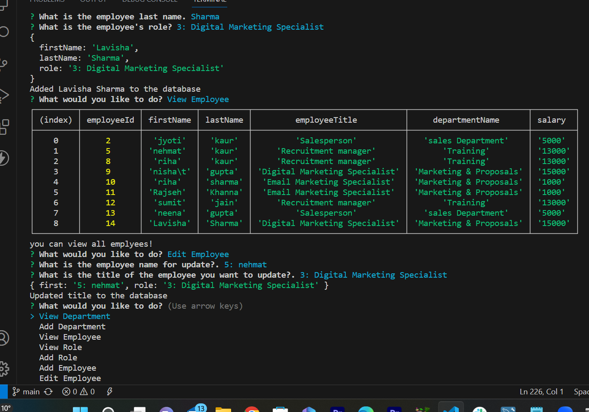

# Employee-Tracker

## Description
This project is based on command-line application  to manage a company's employee database . i have used package of Node Js,mysql12 and also install [Inquirer package](https://www.npmjs.com/package/inquirer/v/8.2.4) for input form user.This is  for  business owner so that they can view and manage the departments, roles, and employees in their company SO THAT they can organize and plan their business. Theu can enter the employee name, salary, and department which they belong, They can save all information in database whenever they want, they can even edit the employee's title.

# github Repo Link
https://github.com/LipikaManglaa/Employee-Tracker.git

SSH LINK: git@github.com:LipikaManglaa/Employee-Tracker.git

# video Link 

https://drive.google.com/file/d/1UG-UVj4rcJpFy1Wb-mPtM96k9ArLsy8J/view

## Table of Contents

  
* [Description](#Description)

* [Screenshots](#Screenshots) 

* [Technologies-Used](#Technologies-Used)

  
* [Installation](#installation)
  
* [Instructions](#Instructions) 
          
* [Questions](#questions)
 
* [Usage](#usage)

* [License](#license)          

## Installation
1. In order to install this project you must clone this project on to your local machine.

2. To install node.js v18 using the terminal, refer to the documentation for the appropriate command. also install myslq12 for database 

3. After installing node.js v18, use the command "npm init -y" in the terminal to create a package.json file for storing project files

4. Using the terminal, run "npm i" to install the application's dependencies. For inquirer, developers can install them directly from the command line using "npm i inquirer@8.2.4" for version 8.2.4 of inquirer  
5. Type "npm start" in the terminal to run the application.

## Usage
This project usage is for anyone that needs a employee tracker app for their employees!

## Instructions
If you would like to see how to use employee tracker for their business  then you can check my github repo and let you know  how to use it

## Screenshots 
 example of list o0f actions which can perform

## View Deparment
   # you can see view all your department which is save in database
  

## View Employee
   # you can see view all your employess details 
  

## Add Employee
   # you can add new employess details 
  

## Add Role
   # you can add new role employess details 
  

  ## Update
   # you can update info your employess details 
  
## License
This application is covered under the MIT license

## Questions
Created by: LipikaManglaa

If you have any further questions please feel free to contact me at lipika.mangla.web@gmail.com
